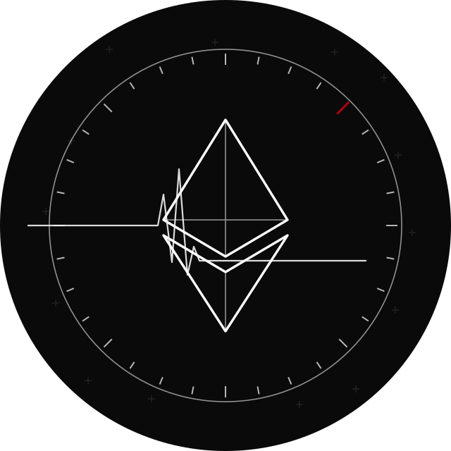
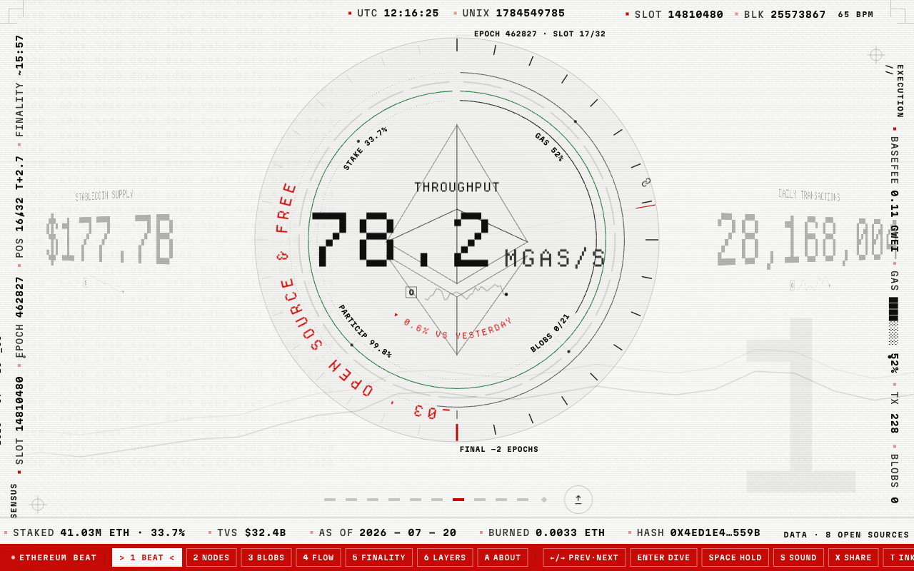

<p align="center">
  
</p>

<h1 align="center">Ethereum Beat</h1>

<p align="center">
  <a href="LICENSE"></a>
  <a href="https://ethereumbeat.org"></a>
  <a href="https://github.com/ethereumbeat/ethereum-beat/discussions"></a>
</p>

<p align="center"><strong>Watch Ethereum's protocol health beat like a heart — one vital per 12-second slot, no prices, no market talk.</strong></p>

The pulse of Ethereum. A centre glyph beats in time with real 12-second slots;
each beat surfaces one measure of protocol health, grouped by the four **CROPS**
properties from the [EF mandate](https://ethereum.org/foundation/mandate/) —
**C**ensorship **R**esistance, **O**pen source and free, **P**rivacy,
**S**ecurity. Uptime is not a CROPS property; it is the mission CROPS protects,
shown as the heartbeat. No prices, no candles, no market talk.

<p align="center">
  <a href="https://ethereumbeat.org"></a>
</p>

Built with Astro + one React island on Cloudflare Workers (D1 + KV + one daily
cron), free tier throughout. Charts and the world map are hand-rolled SVG.

## Deploy your own fork

[](https://deploy.workers.cloudflare.com/?url=https://github.com/ethereumbeat/ethereum-beat)

The button forks the repo and wires up a Worker; it runs fully on Cloudflare's
free tier. You still create your own D1 + KV bindings and seed the data once —
the two-minute [Setup](#setup) below walks through it.

### 60-second quickstart

```sh
git clone https://github.com/ethereumbeat/ethereum-beat && cd ethereum-beat
npm install
npm run dev        # http://localhost:8788
```

The live clock, block feed and mempool tiers work immediately — no account, no
keys. To fill in the daily metrics (staking, value secured, node geography, …),
run `npm run seed` once. Full deploy (bindings + remote seed) is in
[Setup](#setup).

Want to help instead of host? See **[Contributing](CONTRIBUTING.md)**, open an
issue, or start a thread in
**[Discussions](https://github.com/ethereumbeat/ethereum-beat/discussions)**.

## How it works

```
                 ┌──────────────────────── Cloudflare Worker ───────────────────────┐
daily cron ──────► worker/collector.ts ──► D1 (metrics, metric_meta) ──► KV snapshot │
                 │        │                                                          │
browser ─────────► Astro pages + /api/snapshot + /api/metric/[key] (edge-cached 1h) │
                 └────────────────────────────────────────────────────────────────── ┘
```

- **Tier 1 liveness** (slot, epoch, uptime, finality countdown) is pure clock
  maths from the Beacon genesis timestamp; it needs no server at all.
- **Tier 2** is one `eth_getBlockByNumber` per slot against public RPCs with
  ordered fallback (PublicNode, dRPC, 1RPC).
- **Tier 3** and everything historical comes from the daily collector:
  growthepie, the Beacon API, ultrasound.money and DefiLlama, each behind its
  own try/catch so a failing source never blocks the others.

## Setup

Requirements: Node 22+, a Cloudflare account, `npm i -g wrangler` (or use `npx`).

```sh
git clone https://github.com/ethereumbeat/ethereum-beat && cd ethereum-beat
npm install
```

### Create your bindings

`wrangler.toml` ships with placeholder IDs. Create your own resources and
paste the returned IDs into it:

```sh
wrangler d1 create ethereum_beat        # -> [[d1_databases]] database_id
wrangler kv namespace create SNAP      # -> [[kv_namespaces]] id
```

### Seed

Backfills full daily history from growthepie's export endpoints plus current
values from the live sources, into local or remote D1. Idempotent.

```sh
npm run seed              # local D1 (used by wrangler dev)
npm run seed -- --remote  # production D1, run before first deploy
```

### Develop

```sh
npm run dev       # Astro dev server with local D1/KV (platform proxy)
npm run build     # build the Worker into dist/
npm run preview   # wrangler dev against the built Worker
curl "http://localhost:8788/__scheduled?cron=0+6+*+*+*"   # run the collector once
                  # (needs wrangler dev --test-scheduled)
```

### Deploy

> **`wrangler.toml` is intentionally placeholdered.** The committed file ships
> `database_id = "REPLACE_WITH_YOUR_D1_DATABASE_ID"` and
> `id = "REPLACE_WITH_YOUR_KV_NAMESPACE_ID"` — no real IDs are tracked. Create
> your own bindings (see [Create your bindings](#create-your-bindings) above:
> `wrangler d1 create` / `wrangler kv namespace create`), paste the returned
> IDs into your local `wrangler.toml`, and **keep that edit uncommitted** so
> real IDs never land in git.

```sh
npm run seed -- --remote   # once
npm run deploy             # astro build && wrangler deploy
```

The cron trigger (`0 6 * * *` UTC) starts running automatically after deploy.
KV fills itself: the first request to `/api/snapshot` computes the snapshot
from D1 if the key is missing.

## Secrets (all optional)

The site runs fully keyless. Optional keys unlock extra metrics:

| Secret | Unlocks |
|---|---|
| `BEACONCHAIN_API_KEY` | `validators_active` (beaconcha.in requires a key since 2026) |
| `DUNE_API_KEY` | reserved for `contracts_deployed` (not implemented, see DECISIONS.md) |
| `ETHERSCAN_API_KEY` | reserved, unused |

Production: `wrangler secret put BEACONCHAIN_API_KEY`.
Local: copy `.dev.vars.example` to `.dev.vars` (gitignored) and fill it in.

### Daily broadcast (optional)

The daily cron also publishes a non-financial digest of the day's vitals. Each
channel is independent and skips cleanly when its key is unset:

| Secret | Enables |
|---|---|
| `NOSTR_NSEC` | Nostr — a signed kind-1 note (nsec or hex). `NOSTR_RELAYS` overrides the relay set |
| `FARCASTER_FID` + `FARCASTER_SIGNER` | Farcaster — a cast via the direct hub path. `FARCASTER_HUB` sets a write-capable hub |

There is no X API (no free tier as of Feb 2026): the post is written to
`/broadcast/x-draft.json` for manual posting. In production these secrets are
GitHub secrets, injected into `wrangler.ci.toml` at deploy time (never the
committed config) — see `.github/workflows/deploy.yml`. Run `npm run
test:broadcast` to check the signing and digest logic offline.

## Adding a metric

1. **Metadata**: add a row in `db/meta.sql` (label, category, unit, one-line
   description, source attribution, `featured`, `agg_mode`: `mean`|`sum`|`last`),
   then re-apply it: `wrangler d1 execute ethereum_beat --file db/meta.sql`.
2. **Source module**: add `worker/sources/yoursource.ts` exporting
   `fetchDaily(env): Promise<Row[]>`, register it in `worker/collector.ts`
   (and in `scripts/seed.ts` if it can backfill history). `curl` the endpoint
   first and parse what it actually returns.
3. **Seed and check**: `npm run seed`, then hit
   `/api/metric/your_key?range=d|w|m|q|y`.

Set `featured = 1` and it enters the home rotation automatically once it has
data; metrics without data never render, so a broken source degrades silently.

## API

Open CORS, edge-cached one hour:

- `GET /api/snapshot` — latest value, 30-point sparkline and d/w/m/q/y deltas
  for every metric with data.
- `GET /api/metric/[key]?range=d|w|m|q|y` — aggregated series plus metadata.
- `GET /api/roadmap` — upcoming network upgrades (plain-language, with target
  windows, EIPs and CROPS tags) behind the ROADMAP channel.

## Live badges

Embed a live vital in your own README or site. Each badge is a self-contained
SVG served from the cached snapshot (never a live query), links back here, and
renders standalone in an ``:

[](https://ethereumbeat.org/badges)
[](https://ethereumbeat.org/badges)
[](https://ethereumbeat.org/badges)

```markdown
[](https://ethereumbeat.org)
```

Browse all of them, with copy-paste snippets, at
**[ethereumbeat.org/badges](https://ethereumbeat.org/badges)**.

## Data

Displayed data comes from third-party sources under their own terms:

- **[growthepie](https://www.growthepie.com)** — CC BY 4.0, attribution
  required and given (in the UI footer, detail views and /about).
- **[ethernodes.org](https://ethernodes.org)** (bitfly explorer gmbh) — node
  country and client aggregates, baked at build time with a visible date
  stamp; attribution required and given.
- **[DefiLlama](https://defillama.com)**, **[ultrasound.money](https://ultrasound.money)**,
  **[PublicNode](https://publicnode.com)**, **[dRPC](https://drpc.org)**,
  **[1RPC](https://1rpc.io)**, **[beaconcha.in](https://beaconcha.in)** — free/public endpoints.
- **[Natural Earth](https://www.naturalearthdata.com)** — public domain map data.
- **[Forkcast](https://forkcast.org)** (Ethereum Foundation) — structured upgrade
  data behind the **ROADMAP** channel, with the [EF roadmap](https://ethereum.org/roadmap)
  and **[strawmap.org](https://strawmap.org)** for the long-range view.

Endpoint verification notes and every degradation decision live in
[DECISIONS.md](DECISIONS.md).

## Roadmap channel (CH 07)

`/roadmap` translates Ethereum's upgrade roadmap into plain-language
"what's coming", grouped by the CROPS properties each upgrade advances (EIP
numbers are decorative tokens). It reads its own D1 tables (`roadmap_upgrades`,
`roadmap_eips` — `metric_meta` is untouched); the daily cron refreshes the
machine fields (status, target window, meta links) from Forkcast while the
non-financial summaries and CROPS tags stay hand-authored in `db/roadmap.sql`.

The tables are a **schema change**, so on an existing production database they
must be applied to remote D1 **by hand** (the deploy pipeline never runs
migrations):

```sh
wrangler d1 execute ethereum_beat --remote --file db/migrations/006_roadmap.sql
wrangler d1 execute ethereum_beat --remote --file db/roadmap.sql
```

No KV bust is required — `/roadmap` and `/api/roadmap` self-heal from D1 when
`roadmap:latest` is missing. Bust it only to force an immediate refresh:
`wrangler kv key delete --binding=SNAP roadmap:latest --remote`.

## Community

- **[Contributing](CONTRIBUTING.md)** — how to add a metric, the quality gates, the type rule.
- **[Discussions](https://github.com/ethereumbeat/ethereum-beat/discussions)** — questions, ideas, and "should we track X?" before opening an issue.
- **[Propose a metric](https://github.com/ethereumbeat/ethereum-beat/issues/new?template=metric_request.md)** — the guided template walks you through the `metric_meta` workflow.
- **[Roadmap](ROADMAP.md)** — what's shipped and what's next (P0–P3).
- **[Code of Conduct](CODE_OF_CONDUCT.md)** — the standard we hold each other to.
- **[Security policy](SECURITY.md)** — report vulnerabilities privately, never in a public issue.
- **[Support](https://ethereumbeat.org/support)** — keep it running (open source, free tier, no ads).

## Trademark note

The Ethereum glyph and name are used to represent the Ethereum network. This
project is independent ecosystem work and is not affiliated with or endorsed
by the Ethereum Foundation.

## Licence

Code is [MIT](LICENSE). Fonts are Departure Mono, Martian Mono and Inter, all
under the SIL Open Font Licence (licence files alongside the woff2s in
`public/fonts/`).
